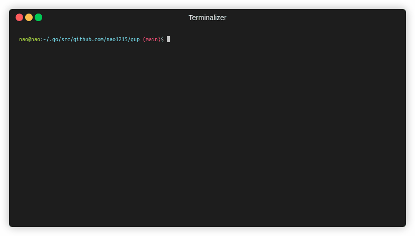
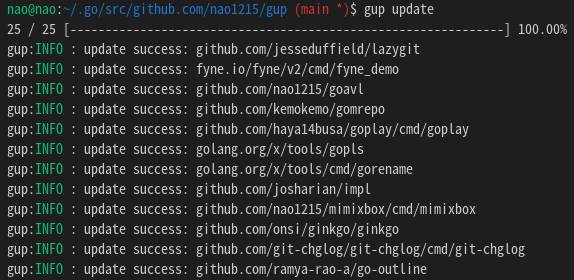
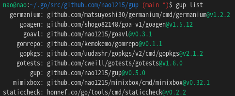

[](https://goreportcard.com/report/github.com/Akimon658/gup)
[[日本語](./doc/ja/README.md)]

# gup - Update binaries installed by `go install`



`gup` command updates binaries installed by `go install` to the latest version.
It updates all binaries in parallel, so very fast.
It also provides subcommands for manipulating binaries under \$GOPATH/bin (\$GOBIN).
It is a cross-platform software that runs on Windows, Mac and Linux.



This is a fork of [nao1215/gup](https://github.com/nao1215/gup) that focuses on simplicity.

## How to install

### Build from source (recommended)

```bash
go install github.com/Akimon658/gup@latest
```

### Binary install

Download from [Releases page](https://github.com/Akimon658/gup/releases).

You can install gup without [Golang](https://go.dev/dl/), but you still need to install it as gup depends on the `go` command internally.

## Usage

### Update all binaries

If you want to update all binaries, just run `gup update`.

```
$ gup update
gup:INFO : update binary under $GOPATH/bin or $GOBIN
gup:INFO : [ 1/30] github.com/cheat/cheat/cmd/cheat (Already up-to-date: v0.0.0-20211009161301-12ffa4cb5c87)
gup:INFO : [ 2/30] fyne.io/fyne/v2/cmd/fyne_demo (Already up-to-date: v2.1.3)
gup:INFO : [ 3/30] github.com/nao1215/gal/cmd/gal (v1.0.0 to v1.2.0)
gup:INFO : [ 4/30] github.com/matsuyoshi30/germanium/cmd/germanium (Already up-to-date: v1.2.2)
gup:INFO : [ 5/30] github.com/onsi/ginkgo/ginkgo (Already up-to-date: v1.16.5)
gup:INFO : [ 6/30] github.com/git-chglog/git-chglog/cmd/git-chglog (Already up-to-date: v0.15.1)
   :
   :
```

### Update the specified binary

If you want to update only the specified binaries, you specify multiple command names separated by space.

```
$ gup update subaru gup ubume
gup:INFO : update binary under $GOPATH/bin or $GOBIN
gup:INFO : [1/3] github.com/Akimon658/gup (v0.7.0 to v0.7.1)
gup:INFO : [2/3] github.com/nao1215/subaru (Already up-to-date: v1.0.2)
gup:INFO : [3/3] github.com/nao1215/ubume/cmd/ubume (Already up-to-date: v1.4.1)
```

### List up command name with package path and version under $GOPATH/bin

`list` subcommand prints command informations of binaries under $GOPATH/bin or $GOBIN.
The output informations are the command name, package path, and command version.



### Remove the specified binary

If you want to remove a command under $GOPATH/bin or $GOBIN, use the `remove` subcommand.
The `remove` subcommand asks if you want to remove it before removing it.

```
$ gup remove subaru gal ubume
gup:CHECK: remove /home/nao/.go/bin/subaru? [Y/n] Y
gup:INFO : removed /home/nao/.go/bin/subaru
gup:CHECK: remove /home/nao/.go/bin/gal? [Y/n] n
gup:INFO : cancel removal /home/nao/.go/bin/gal
gup:CHECK: remove /home/nao/.go/bin/ubume? [Y/n] Y
gup:INFO : removed /home/nao/.go/bin/ubume
```

If you want to force the removal, use the `--force` option.

```
$ gup remove --force gal
gup:INFO : removed /home/nao/.go/bin/gal
```

### Check if the binary is the latest version

If you want to know if the binary is the latest version, use the `check` subcommand.
`check` subcommand checks versions and displays the name of the binaries that need to be updated.

```
$ gup check
gup:INFO : check binary under $GOPATH/bin or $GOBIN
gup:INFO : [ 1/33] github.com/cheat/cheat (Already up-to-date: v0.0.0-20211009161301-12ffa4cb5c87)
gup:INFO : [ 2/33] fyne.io/fyne/v2 (current: v2.1.3, latest: v2.1.4)
   :
gup:INFO : [33/33] github.com/nao1215/ubume (Already up-to-date: v1.5.0)

gup:INFO : If you want to update binaries, the following command.
           $ gup update fyne_demo gup mimixbox 
```

Like other subcommands, you can only check the specified binaries.

```
$ gup check lazygit mimixbox
gup:INFO : check binary under $GOPATH/bin or $GOBIN
gup:INFO : [1/2] github.com/jesseduffield/lazygit (Already up-to-date: v0.32.2)
gup:INFO : [2/2] github.com/nao1215/mimixbox (current: v0.32.1, latest: v0.33.2)

gup:INFO : If you want to update binaries, the following command.
           $ gup update mimixbox 
```

### Export/Import

You use the `export`/`import` subcommand if you want to install the same Golang binaries across multiple systems.
By default, `export` subcommand exports the file to $HOME/.config/gup/gup.conf.
After you have placed gup.conf in the same path hierarchy on another system, you execute `import` subcommand.
gup start the installation according to the contents of gup.conf.

```
※ Environmet A (e.g. ubuntu)
$ gup export
gup:INFO: Export /home/nao/.config/gup/gup.conf

※ Environmet B (e.g. debian)
$ ls /home/nao/.config/gup/gup.conf
/home/nao/.config/gup/gup.conf
$ gup import
```

# Contributing

First off, thanks for taking the time to contribute!
See [CONTRIBUTING.md](./CONTRIBUTING.md) for more information.

# LICENSE

The gup project is licensed under the terms of [the Apache License 2.0](./LICENSE).
This is a fork repository of [nao1215/gup](https://github.com/nao1215/gup).
