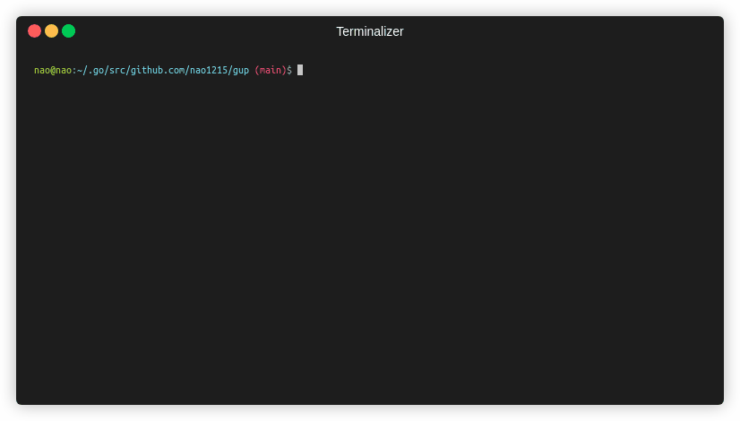
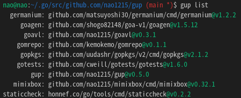

# gup



`gup` コマンドは、`go install` でインストールしたバイナリを最新版にアップデートします。
gup は、すべてのバイナリを並列にアップデートするので、非常に高速です。
\$GOPATH/bin (\$GOBIN) 以下にあるバイナリを操作するためのサブコマンドも提供しています。
クロスプラットホームソフトであり、Windows、Mac、Linux で動作します。


これは [nao1215/gup](https://github.com/nao1215/gup) のシンプルさに重点を置いたフォークです。

## インストール方法

### ソースからのビルド（推奨）

```bash
go install github.com/Akimon658/gup@latest
```

### ビルド済みバイナリのダウンロード

[リリースページ](https://github.com/Akimon658/gup/releases)からダウンロードできます。

gup そのものは [Golang](https://go.dev/dl/) なしでインストールできますが、内部では `go` コマンドに依存しているため Go もインストールしておく必要があります。

## 使用方法

### 全てのバイナリをアップデート

全てのバイナリをアップデートしたい場合は、`gup update` を実行してください。

```
$ gup update
gup:INFO : update binary under $GOPATH/bin or $GOBIN
gup:INFO : [ 1/30] github.com/cheat/cheat/cmd/cheat (Already up-to-date: v0.0.0-20211009161301-12ffa4cb5c87)
gup:INFO : [ 2/30] fyne.io/fyne/v2/cmd/fyne_demo (Already up-to-date: v2.1.3)
gup:INFO : [ 3/30] github.com/nao1215/gal/cmd/gal (v1.0.0 to v1.2.0)
gup:INFO : [ 4/30] github.com/matsuyoshi30/germanium/cmd/germanium (Already up-to-date: v1.2.2)
gup:INFO : [ 5/30] github.com/onsi/ginkgo/ginkgo (Already up-to-date: v1.16.5)
gup:INFO : [ 6/30] github.com/git-chglog/git-chglog/cmd/git-chglog (Already up-to-date: v0.15.1)
   :
   :
```

### 指定バイナリのみアップデート

指定のバイナリのみを更新したい場合、`update` サブコマンドに複数のコマンド名をスペース区切りで渡してください。

```
$ gup update subaru gup ubume
gup:INFO : update binary under $GOPATH/bin or $GOBIN
gup:INFO : [1/3] github.com/Akimon658/gup (v0.7.0 to v0.7.1)
gup:INFO : [2/3] github.com/Akimon658/subaru (Already up-to-date: v1.0.2)
gup:INFO : [3/3] github.com/nao1215/ubume/cmd/ubume (Already up-to-date: v1.4.1)
```

### $GOPATH/bin 以下にあるバイナリ情報の一覧出力

`list` サブコマンドは、$GOPATH/bin（もしくは $GOBIN）以下にあるバイナリの情報を表示します。
表示内容は、コマンド名、パッケージパス、コマンドバージョンです。



### 指定バイナリを削除

\$GOPATH/bin (\$GOBIN) 以下にあるバイナリを削除する場合は、`remove` サブコマンドを使用してください。
`remove` サブコマンドは、削除前に削除してよいかどうかを確認します。

```
$ gup remove subaru gal ubume
gup:CHECK: remove /home/nao/.go/bin/subaru? [Y/n] Y
gup:INFO : removed /home/nao/.go/bin/subaru
gup:CHECK: remove /home/nao/.go/bin/gal? [Y/n] n
gup:INFO : cancel removal /home/nao/.go/bin/gal
gup:CHECK: remove /home/nao/.go/bin/ubume? [Y/n] Y
gup:INFO : removed /home/nao/.go/bin/ubume
```

確認無しで削除したい場合は, `--force` オプションを使用してください。

```
$ gup remove --force gal
gup:INFO : removed /home/nao/.go/bin/gal
```

### バイナリが最新版かどうかのチェック

バイナリが最新版かどうかを知りたい場合は、`check` サブコマンドを使用してください。
`check` サブコマンドはバイナリの最新バージョンをチェックし、アップデートが必要なものを表示します。

```
$ gup check
gup:INFO : check binary under $GOPATH/bin or $GOBIN
gup:INFO : [ 1/33] github.com/cheat/cheat (Already up-to-date: v0.0.0-20211009161301-12ffa4cb5c87)
gup:INFO : [ 2/33] fyne.io/fyne/v2 (current:v2.1.3, latest:v2.1.4)
   :
gup:INFO : [33/33] github.com/nao1215/ubume (Already up-to-date: v1.5.0)

gup:INFO : If you want to update binaries, the following command.
           $ gup update fyne_demo gup mimixbox
```

他のサブコマンドと同様、指定のバイナリのみをチェックする事もできます。

```
$ gup check lazygit mimixbox
gup:INFO : check binary under $GOPATH/bin or $GOBIN
gup:INFO : [1/2] github.com/jesseduffield/lazygit (Already up-to-date: v0.32.2)
gup:INFO : [2/2] github.com/nao1215/mimixbox (current: v0.32.1, latest: v0.33.2)

gup:INFO : If you want to update binaries, the following command.
           $ gup update mimixbox
```

### エクスポート・インポート

新しい環境などに一括でコマンドをインストールしたいときには `export`/`import` サブコマンドを使うことができます。

`export` サブコマンドはパッケージのパスを標準出力に表示するので、ファイルとして保存するにはリダイレクトを使ってください。

```bash
gup export > path/to/file
```

エクスポートしたファイルをインストール先の環境にコピーしたら、`import` サブコマンドで全てインストールされます。

```bash
gup import path/to/file
```

### 設定

`go install` に渡す `ldflags` と `tags` を YAML で定義することができます。

デフォルトでは $XDG_CONFIG_HOME/gup/package.yml が使われますが、環境変数が定義されていない場合には以下のディレクトリが使われます。

<details>
  <summary>代替ディレクトリ</summary>

  |OS     |ディレクトリ                 |
  |:-----:|-----------------------------|
  |Linux  |~/.config                    |
  |macOS  |~/Library/Application Support|
  |Windows|%LOCALAPPDATA%               |

  詳しくは [adrg/xdg](https://github.com/adrg/xdg) をご覧ください。
</details>

#### 例

```yaml
global:
  ldflags: -s -w

packages:
  - name: hugo
    ldflags: -s -w -X github.com/gohugoio/hugo/common/hugo.vendorInfo=akimon658
    tags: extended
```

`name` がコマンドの名前と一致した場合に `global` の設定を上書きします。

## ライセンス

gup プロジェクトは、[Apache License 2.0](./../../LICENSE) の下でライセンスされています。
また、このリポジトリは [nao1215/gup](https://github.com/nao1215/gup) のフォークです。
